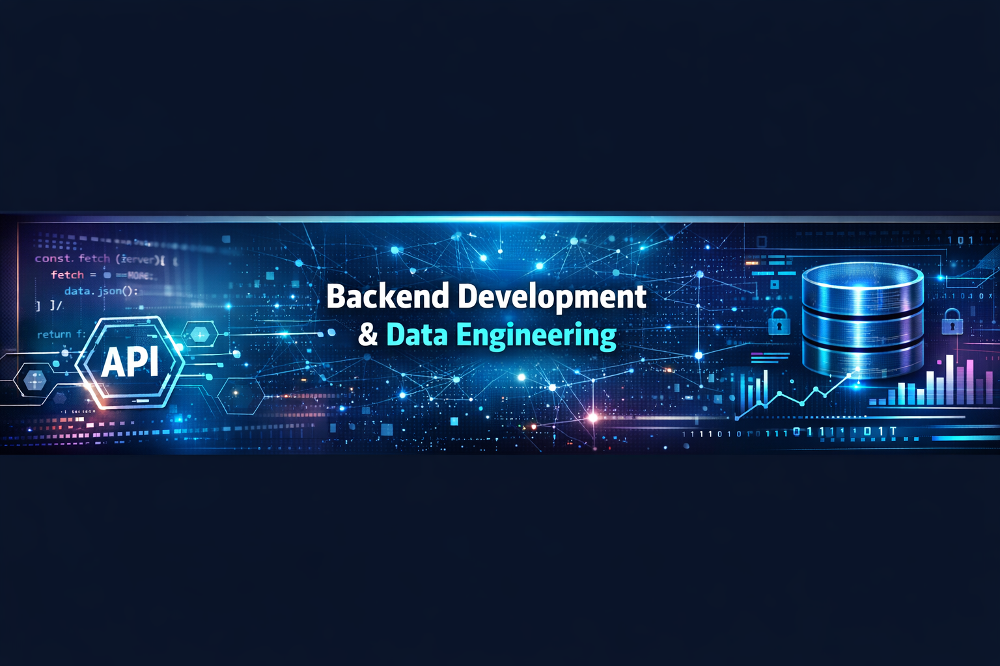

# Hi, I'm Savina Gabba 👋

Backend & Data-Oriented Developer in Training  
Focused on **JavaScript, Node.js, SQL, Python, data analysis and relational database design**.

I am building a technical portfolio that connects my background in **healthcare, customer support and education** with my current path in **backend development, data analysis and databases**.

My current focus is learning by building real projects: REST APIs, public data analysis, SQL database design and technical documentation.

---

## About Me

- Transitioning into tech with a strong interest in backend, data and databases.
- Background in healthcare, customer service, technical support and education.
- Focused on SQL, Python, JavaScript, Node.js, PostgreSQL and MySQL.
- Interested in data analysis, business analysis, backend systems and health-tech projects.
- Building portfolio projects with real-world data, database design and clear documentation.
- Open to junior / trainee opportunities in Data Analysis, Business Analysis, Backend Development, IT Support and technical roles.

---

## Tech Stack

### Backend

- JavaScript
- Node.js
- Express.js
- REST APIs
- API validation
- Error handling
- Postman

### Data Analysis

- Python
- Pandas
- NumPy
- Matplotlib
- Jupyter Notebook
- Exploratory Data Analysis

### Databases

- SQL
- PostgreSQL
- MySQL
- Relational database design
- Data modeling
- Primary keys and foreign keys
- Constraints, views and indexes

### Tools

- Git
- GitHub
- VS Code
- MySQL Workbench
- pgAdmin
- Command line / terminal

---

## Featured Projects

### 1. Scheduling API

REST API for multi-tenant appointment scheduling built with **Node.js, Express and PostgreSQL**.

This project focuses on backend architecture, relational data modeling, business rules, request validation, error handling and technical documentation.

**What it shows:**

- REST API development
- Layered architecture
- PostgreSQL schema design
- Multi-tenant logic with `clinic_id`
- API validation
- Error handling
- Smoke tests and CI basics

**Repository:** [scheduling-api](https://github.com/gabbaSavina/scheduling-api)

---

### 2. Health Facilities Analysis Argentina

Exploratory data analysis project using **Python, Pandas, NumPy and Matplotlib** to analyze healthcare facilities in Argentina based on public open data from REFES.

This project connects my healthcare background with data analysis, focusing on data cleaning, aggregation, visualization and interpretation.

**What it shows:**

- Data cleaning with Pandas
- Exploratory Data Analysis
- Public health data analysis
- Missing values and duplicate checks
- Data visualization with Matplotlib
- Analytical interpretation and documentation

**Repository:** [health-facilities-analysis-argentina](https://github.com/gabbaSavina/health-facilities-analysis-argentina)

---

### 3. Rehabilitation Clinic Database Design

Relational database design project for a rehabilitation clinic using **MySQL**.

This project models patients, professionals, specialties, treatment plans, therapy goals, appointments, session notes and evaluations.

**What it shows:**

- MySQL database design
- Relational modeling
- Normalization
- Primary and foreign keys
- CHECK and UNIQUE constraints
- Analytical SQL queries
- Views and indexes
- Healthcare domain modeling

**Repository:** [rehab-clinic-database-design](https://github.com/gabbaSavina/rehab-clinic-database-design)

---

## What My Portfolio Shows

My current portfolio is built around three connected areas:

| Area | Project | Main Skills |
|---|---|---|
| Backend Development | Scheduling API | Node.js, Express, PostgreSQL, REST APIs |
| Data Analysis | Health Facilities Analysis Argentina | Python, Pandas, NumPy, Matplotlib |
| Database Design | Rehabilitation Clinic Database Design | MySQL, SQL, relational modeling |

Together, these projects show that I can:

- Build backend APIs.
- Work with relational databases.
- Analyze real-world datasets.
- Document technical decisions.
- Translate healthcare domain knowledge into technical projects.
- Learn and apply tools through hands-on practice.

---

## Currently Learning

- Advanced SQL and relational database modeling
- Python for data analysis
- Backend development with Node.js and Express
- PostgreSQL and MySQL
- Data cleaning and exploratory data analysis
- Technical documentation
- Business and data analysis foundations

---

## Professional Direction

I am developing a hybrid profile that combines:

- Backend development
- Data analysis
- SQL and database design
- Healthcare domain knowledge
- Technical documentation
- Problem solving and user-centered thinking

I am especially interested in roles where I can use data and technology to understand problems, improve processes and build useful solutions.

---

## Let's Connect

- LinkedIn: add your LinkedIn URL here
- GitHub: [github.com/gabbaSavina](https://github.com/gabbaSavina)

---

⭐ Always learning, always building.
